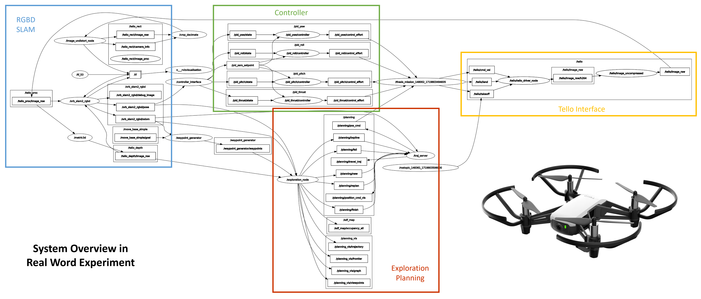

# Efficient Frontier-Based Exploration with A Graph-Based Global Heuristic Planning Structure



## Installation

This project has been tested on Ubuntu 20.04 (ROS Noetic). Please follow the commands from different parts to install the required tools. The main parameter settings are located in the launch files within each directory. Please modify them according to your needs.

## How to run

```bash
# -------------------------------------
# launch ORB-SLAM2
cd ./tello/slam/orb_slam_2_ros_ws

source devel/setup.bash
roslaunch orb_slam2_ros orb_slam2_tello_rgbd.launch

# -------------------------------------
# launch Metric3D
cd ./tello/mde/metric3d_onnx_ws

source devel/setup.bash
roslaunch metric3d metric3d.launch

# -------------------------------------
# launch tello driver
cd ./tello/tello_interface/tello_ros_ws

source devel/setup.bash
roslaunch tello_driver tello_node.launch

# -------------------------------------
# launch exploration and visualization
source devel/setup.bash
roslaunch exploration_manager tello.launch

source devel/setup.bash
roslaunch exploration_manager rviz.launch

# -------------------------------------
# take off tello
rostopic pub /tello/takeoff std_msgs/Empty "{}"
rostopic pub /tello/land std_msgs/Empty "{}"

# -------------------------------------
# launch pid controller
source devel/setup.bash
roslaunch drone_controller waypoint_controller.launch

source devel/setup.bash
rosrun drone_controller thesis_mission.py
```


## Acknowledgements

This project is built upon [FUEL](https://github.com/HKUST-Aerial-Robotics/FUEL). The ROS version of [ORBSLAM2](https://github.com/LucyAV/ORBSLAM2) for RGB-D localization is adapted from [orb_slam_2_ros](https://github.com/appliedAI-Initiative/orb_slam_2_ros). The ONNX version of [Metric3Dv2](https://github.com/YvanYin/Metric3D/tree/main) for monocular depth estimation is adapted from [Metric3D ONNX](https://github.com/Owen-Liuyuxuan/ros2_vision_inference/tree/metric3d). The Tello interface is from [TelloPy](https://github.com/surfii3z/TelloPy). We thank all the authors for their great work and repositories.
